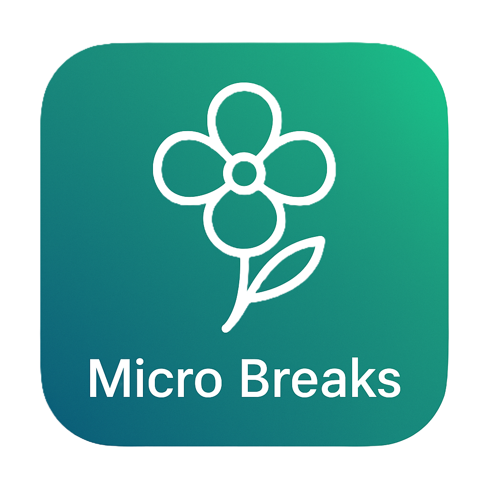

# Micro Breaks
<p align="center">
    
</p>

## Features

- Guided micro-breaks to improve productivity and well-being
- Customizable work and break intervals
- Notifications and reminders for scheduled breaks
- Simple, user-friendly interface
- Progress tracking and daily usage statistics

## Getting Started

### Prerequisites

- Python 3.8 or higher

### Installation

```bash
git clone https://github.com/your-org/micro-break-vibe-coding.git
cd micro-break-vibe-coding
pip install -r requirements.txt


### Running the App

```bash
python src\main.py
```

## Usage

1. Set your preferred work and break durations.
2. Start your work session.
3. Follow the guided micro-breaks when prompted.
4. Track your progress throughout the day.

## Contributing

Contributions are welcome! Please fork the repository and submit a pull request.

## License
This project is licensed for internal use at Cognizant Vibe Coding. Unauthorized use, distribution, or modification of this project is strictly prohibited without explicit consent from the project owner.

## Acknowledgements

Developed by Team Take A Break
Cognizant Vibe Coding 2025